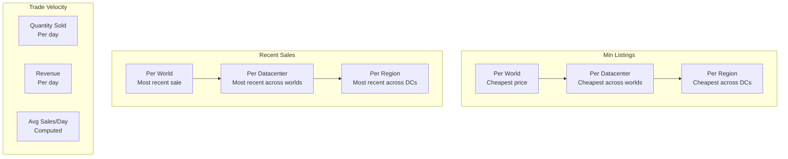
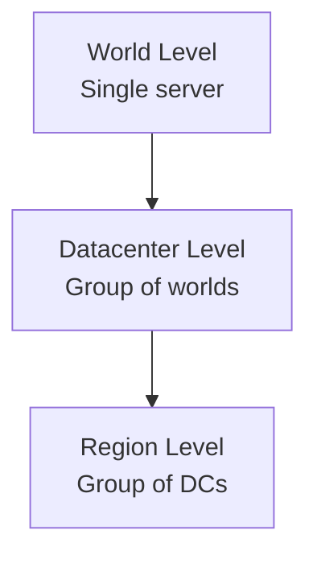
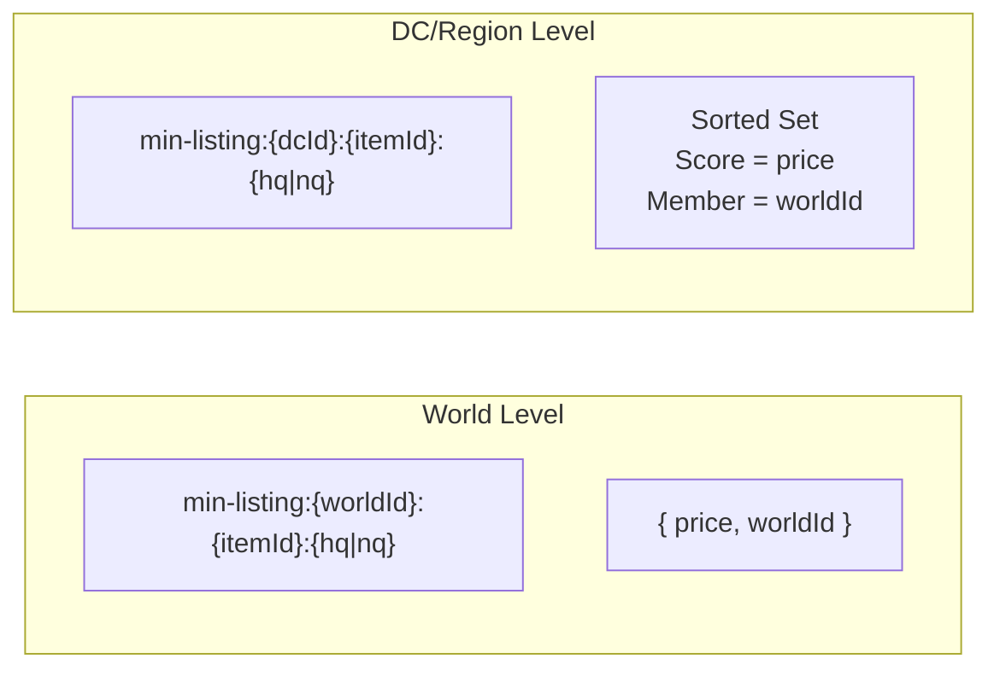
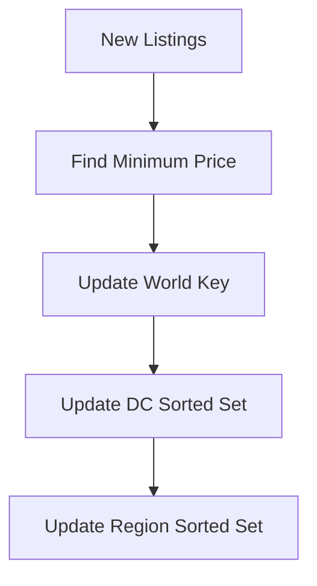
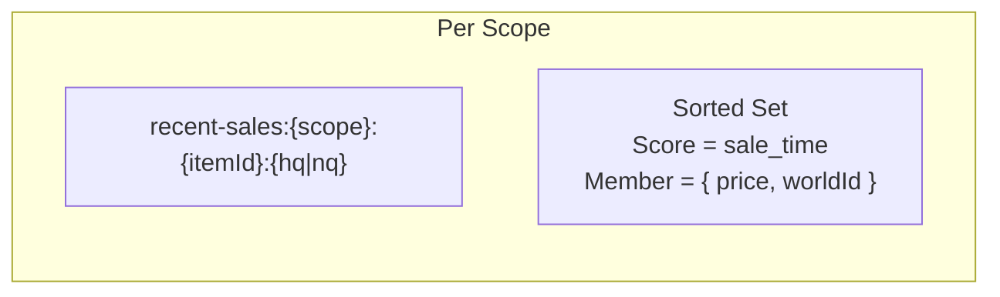
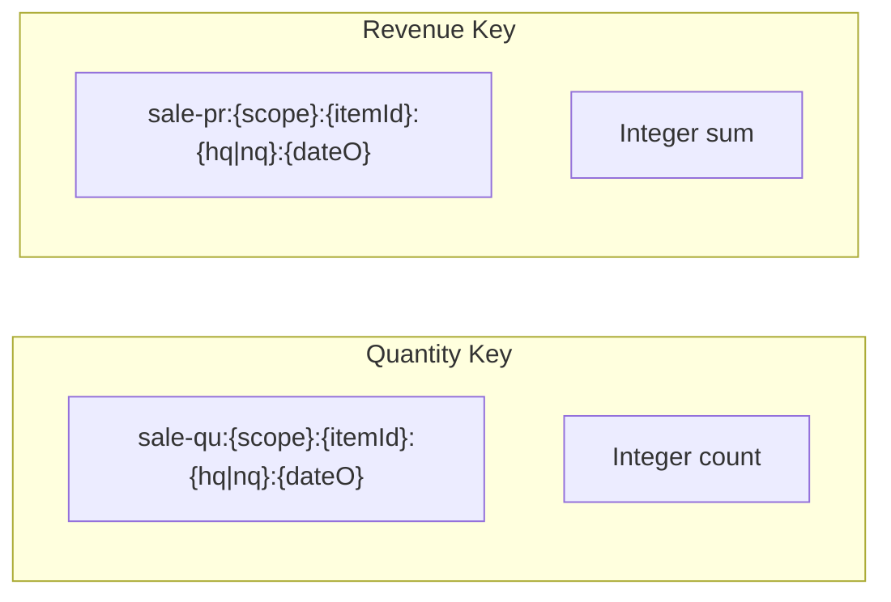
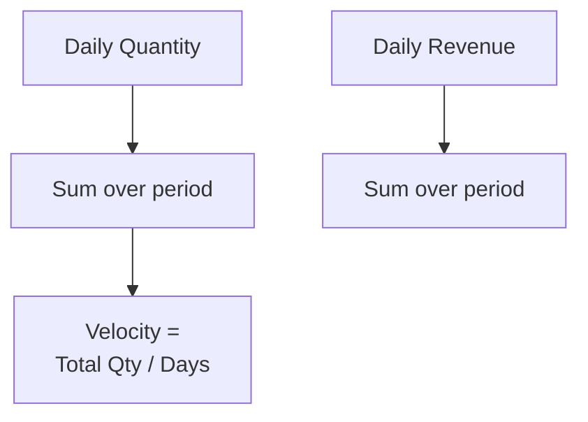
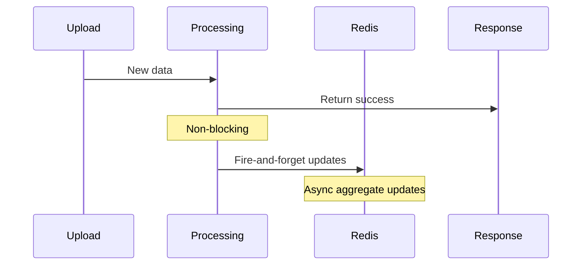

# Aggregations

Pre-computed aggregates enable sub-millisecond lookups for common queries like "cheapest price" or "recent sale velocity". All aggregates are stored in Redis.

## Why Redis?

Aggregates are stored in Redis because:

- **Sub-millisecond Latency**: Critical for API response times
- **Atomic Operations**: Safe concurrent updates
- **Data Structures**: Sorted sets perfect for rankings
- **TTL Support**: Automatic expiration of stale data

## Aggregate Types



## Scope Hierarchy

All aggregates support three scope levels:



Example hierarchy:

- **World**: Adamantoise
- **Datacenter**: Aether (includes Adamantoise, Cactuar, etc.)
- **Region**: North America (includes Aether, Primal, Crystal)

## MinListing

Tracks the cheapest listing for each item at each scope.

### Data Structure



- **World Level**: Simple string with price and world
- **DC/Region Level**: Sorted set to find cheapest across worlds

### Update Flow



Updates are fire-and-forget (non-blocking).

## RecentSale

Tracks the most recent sale for each item at each scope.

### Data Structure



Sorted sets enable:

- Find most recent sale: `ZREVRANGE ... LIMIT 1`
- Find which world had most recent: member includes worldId

## TradeVelocity

Tracks daily trading volume and revenue.

### Data Structure



- `qu` = quantity sum for the day
- `pr` = price (revenue) sum for the day
- `dateO` = date in ordinal format

### Computation



### TTL

Trade velocity keys expire after **7 days** to:

- Limit storage growth
- Keep data fresh
- Allow recalculation on query

## Update Pattern



Key design decision: Aggregate updates don't block the upload response.

- Uses `CommandFlags.FireAndForget`
- Eventual consistency is acceptable
- Keeps upload latency low

## Query Patterns

### Get Minimum Price

```
GET min-listing:{worldId}:{itemId}:nq
GET min-listing:{worldId}:{itemId}:hq
```

### Get Cheapest Across Datacenter

```
ZRANGE min-listing:{dcId}:{itemId}:nq 0 0 WITHSCORES
```

### Get Trade Velocity

```
MGET sale-qu:{scope}:{itemId}:nq:{date1} sale-qu:{scope}:{itemId}:nq:{date2} ...
MGET sale-pr:{scope}:{itemId}:nq:{date1} sale-pr:{scope}:{itemId}:nq:{date2} ...
```

Then compute average.

## Redis Database Layout

Redis databases are partitioned by purpose:

| Database | Purpose                                                 |
| -------- | ------------------------------------------------------- |
| DB 0     | Upload timestamps (sorted sets by world)                |
| DB 1     | Tax rate information                                    |
| DB 2     | Current market state                                    |
| DB 3     | Aggregates (min listings, recent sales, trade velocity) |

## Consistency Model

Aggregates are **eventually consistent**:

- Updated asynchronously after uploads
- Brief windows where aggregate may lag actual data
- Acceptable tradeoff for low latency

For exact current values, query the source data directly.
