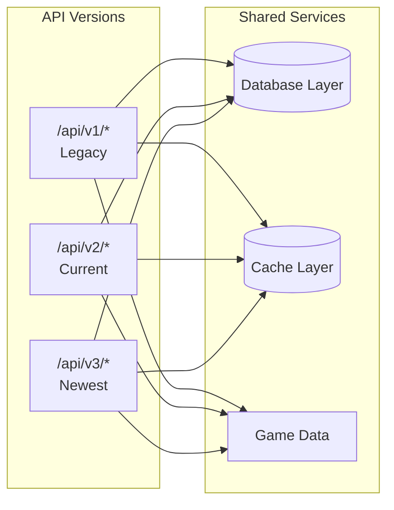
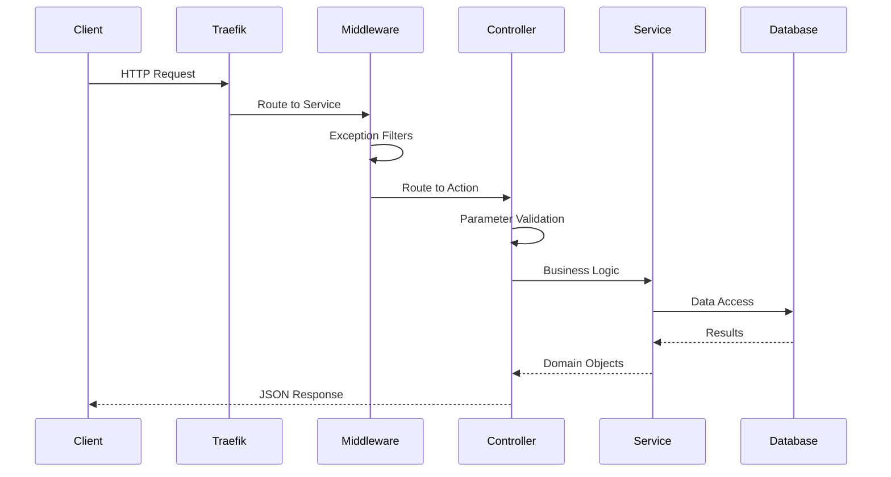
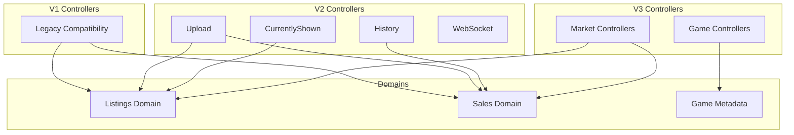

# API Architecture

The Universalis API serves market board data through a versioned REST API with support for real-time updates via WebSocket.

## API Versioning

Three API versions coexist to maintain backward compatibility while evolving the API:

| Version  | Status  | Description                                |
| -------- | ------- | ------------------------------------------ |
| V1       | Legacy  | Original API, maintained for compatibility |
| V2       | Current | Primary API with WebSocket support         |
| V3 (WIP) | Newest  | Refactored response structure              |

## Request Lifecycle

## Controller Organization

Controllers are organized by API version and domain:

## Key Endpoints

### Market Data

- `GET /api/{world}/{itemIds}` - Current listings and recent sales
- `GET /api/history/{world}/{itemIds}` - Historical sales with filtering
- `GET /api/v2/history/{world}/{itemIds}` - Enhanced history with statistics

### Game Data

- `GET /api/v3/game/data-centers` - List of data centers
- `GET /api/v3/game/worlds` - List of worlds

### Real-time

- `GET /api/ws` - WebSocket connection for live updates
- `POST /upload/{apiKey}` - Upload market data

## Request Processing

### Exception Handling

Five specialized exception filters handle different error scenarios:

- Parameter validation errors
- Authentication failures
- Rate limiting
- Database errors
- Unexpected exceptions

### Response Formatting

- JSON serialization with custom converters
- Partial field selection support
- Compression for large responses
- CORS headers for browser clients

## Query Parameters

Common parameters across endpoints:

| Parameter       | Description                  |
| --------------- | ---------------------------- |
| `listings`      | Number of listings to return |
| `entries`       | Number of history entries    |
| `hq`            | Filter by high-quality items |
| `statsWithin`   | Time window for statistics   |
| `entriesWithin` | Time filter for history      |
