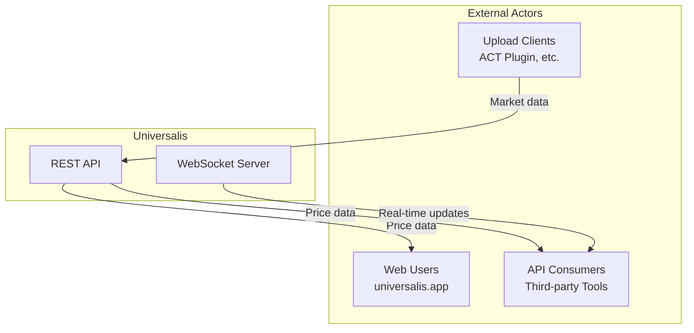
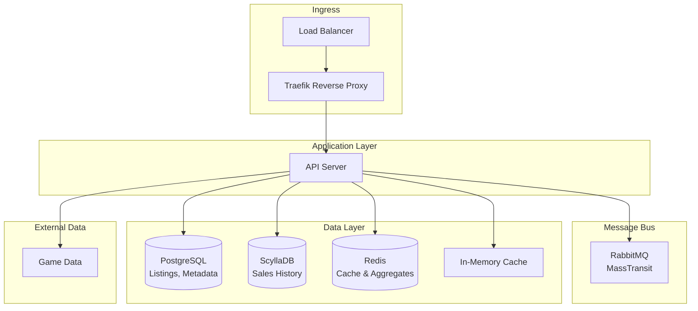

# Universalis Architecture Overview

Universalis is a crowdsourced market board aggregator for FINAL FANTASY XIV. Players upload market data from their game clients, and the service aggregates this data to provide real-time pricing information via REST API and WebSocket streaming.

## System Context

## High-Level Architecture

## Technology Stack

| Layer         | Technology             | Purpose                                   |
| ------------- | ---------------------- | ----------------------------------------- |
| Framework     | ASP.NET Core           | Web API and WebSocket server              |
| Message Bus   | RabbitMQ + MassTransit | Async event distribution                  |
| Listings DB   | PostgreSQL             | Current market listings (ACID)            |
| Sales DB      | ScyllaDB               | Historical sales (time-series)            |
| Cache         | Redis + In-Memory      | Aggregates, hot data, and request caching |
| Game Data     | Various sources        | FFXIV item/world metadata                 |
| Reverse Proxy | Traefik                | Routing and load balancing                |
| Orchestration | Docker Swarm           | Container management                      |
| Metrics       | Victoria Metrics       | Time-series metrics                       |
| Tracing       | Tempo                  | Distributed tracing                       |

## Documentation Index

### Application Architecture

- [API Architecture](api.md) - API versioning, request lifecycle, controllers
- [Upload Pipeline](upload-pipeline.md) - Data ingestion, validation, behavior pattern
- [Real-time Streaming](realtime.md) - WebSocket system, event broadcasting

### Data Flows

- [Listings](listings.md) - Current market listings (PostgreSQL, caching)
- [Sales](sales.md) - Historical sales data (ScyllaDB, deduplication)
- [Aggregations](aggregations.md) - Pre-computed aggregates (Redis)

### Infrastructure

- [Infrastructure](infrastructure.md) - Docker Swarm, service variants
- [Networking](networking.md) - Load balancing, routing, TLS
- [Observability](observability.md) - Metrics, tracing, alerting
