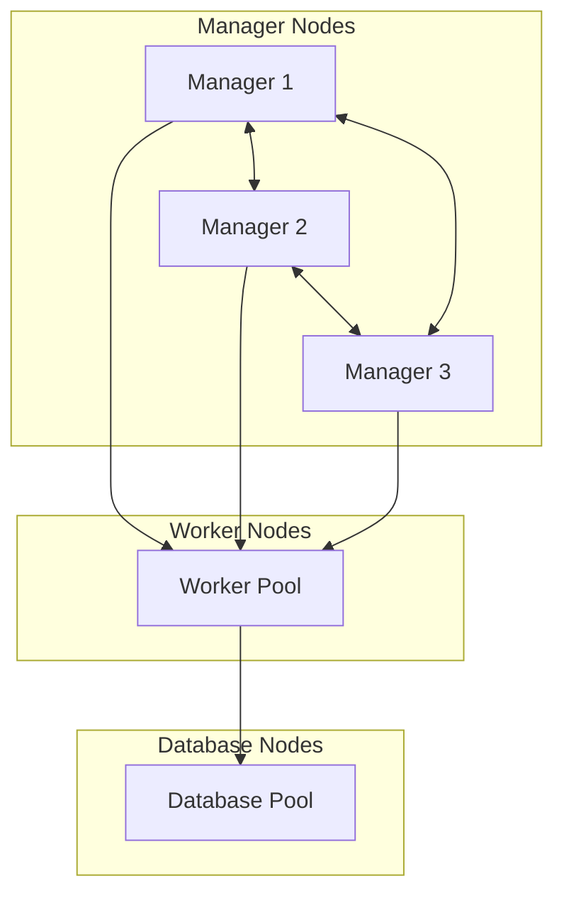
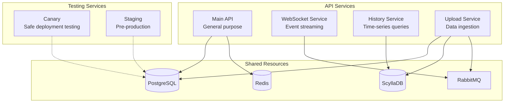
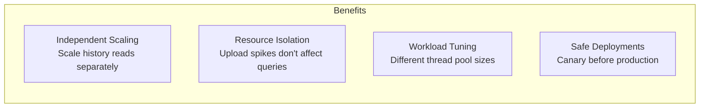
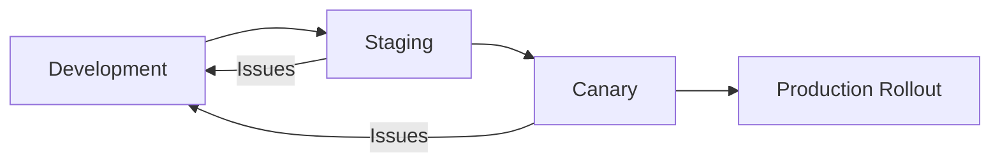
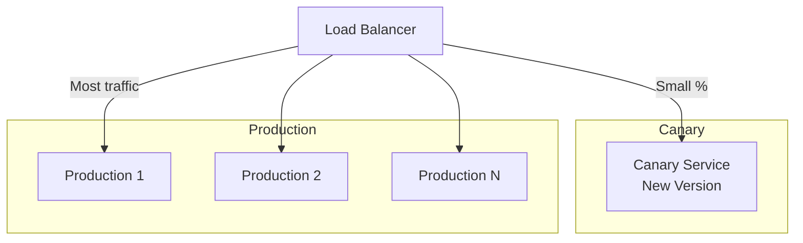
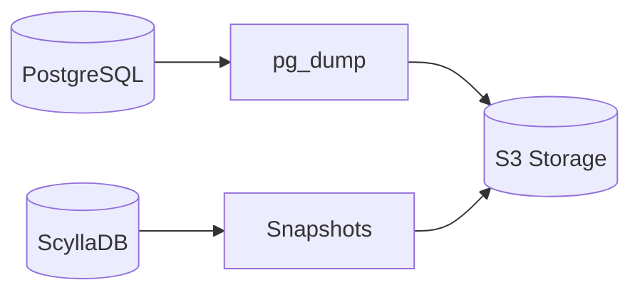

# Infrastructure

Universalis runs on a Docker Swarm cluster with workload-specific service variants. This document covers the cluster architecture and deployment patterns.

## Cluster Architecture

### Node Types

| Type | Role |
|------|------|
| Manager | Cluster orchestration, Traefik ingress, scheduling |
| Worker | Application services |
| Database | Dedicated database workloads (ScyllaDB, PostgreSQL) |

## Service Variant Pattern

The same application codebase runs as multiple services, each optimized for a specific workload.

### Service Purposes

| Service | Workload | Optimization |
|---------|----------|--------------|
| Main API | General queries | Balanced resources |
| WebSocket | Event streaming | High connection count, low memory per connection |
| History | Time-series queries | Large memory for result sets, ScyllaDB tuning |
| Upload | Data ingestion | Large buffers, write-optimized |
| Canary | Deployment testing | Single replica for safe rollout |
| Staging | Pre-production | Minimal resources |

### Why Separate Services?

1. **Independent Scaling**: Scale history service during high query load without scaling uploads
2. **Resource Isolation**: Upload spikes don't starve query resources
3. **Workload Tuning**: Each service has optimized thread pool, buffer sizes, connection limits
4. **Safe Deployments**: Canary service tests changes before full rollout

## Deployment Flow

### Canary Pattern

- Small percentage of traffic routes to canary
- Monitor for errors before full rollout
- Easy rollback by removing canary routing

## Configuration by Service

Each service variant has different configuration:

### Thread Pool
- Main API: High thread count for concurrent requests
- Upload: Moderate threads, focus on I/O
- WebSocket: Low threads, async I/O

### Buffer Sizes
- Upload: Large read/write buffers for data ingestion
- History: Large result buffers for big queries
- WebSocket: Small buffers, many connections

### Connection Pools
- Main API: Balanced PostgreSQL connections
- History: More ScyllaDB connections
- Upload: Write-focused connection allocation

## Backup Strategy

- PostgreSQL: Daily dumps to S3-compatible storage
- ScyllaDB: Built-in snapshot mechanism
- Redis: Configurable persistence (AOF/RDB)

## Health Checks

Each service exposes health endpoints:
- Readiness: Can accept traffic
- Liveness: Process is healthy

Swarm uses these for:
- Rolling updates without downtime
- Automatic restart of failed containers
- Load balancer routing decisions
