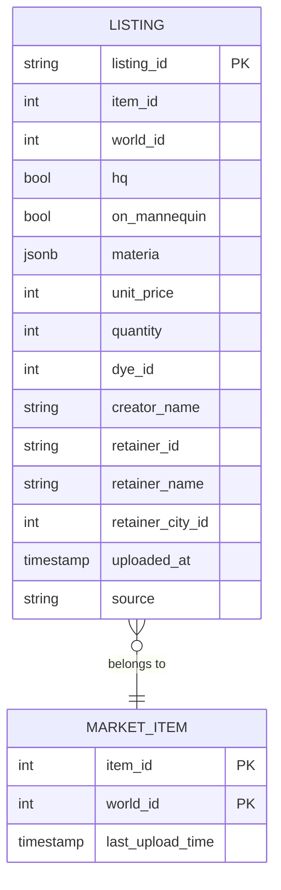
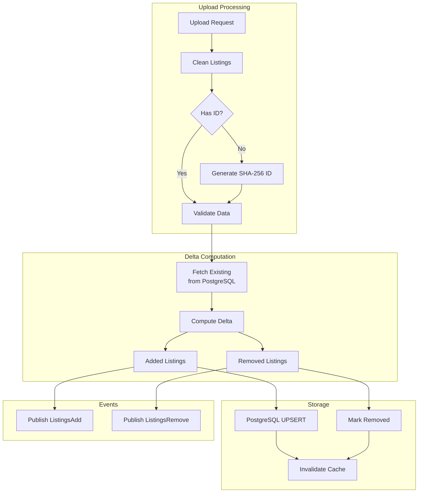
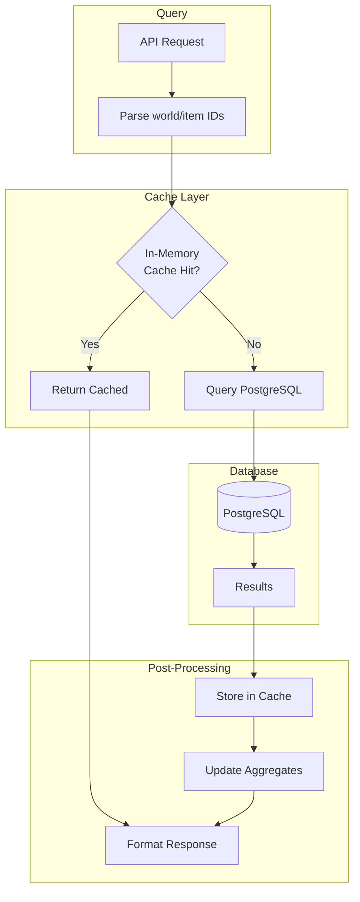
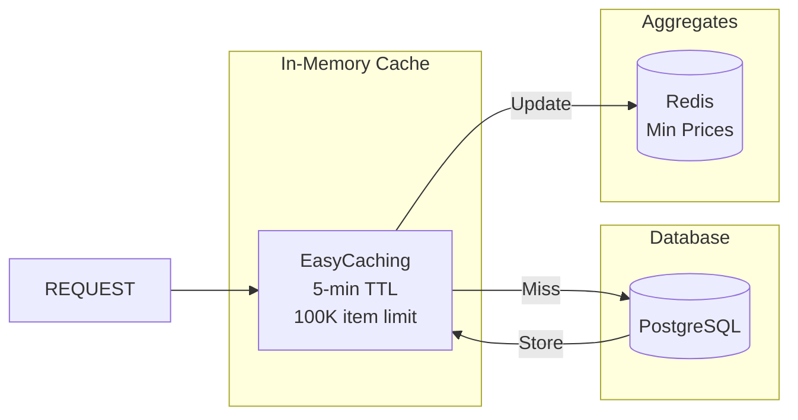
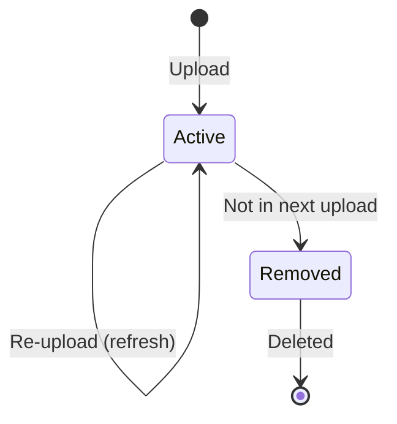

# Listings Data Flow

Current market listings represent items actively for sale on retainers. This document covers the complete flow from upload to query.

## Why PostgreSQL?

Listings are stored in PostgreSQL because:

- **ACID Compliance**: Listings need consistent state (all-or-nothing updates)
- **Current State**: Only the latest listings matter, not history
- **Fast Lookups**: Indexed queries by world/item are efficient
- **Full Replacement**: Atomic upsert on each upload

## Listing Entity



Key fields:

- **listing_id**: Unique identifier (generated if missing via SHA-256)
- **materia**: Array of slot/materia pairs stored as JSONB
- **source**: Upload source for analytics
- **uploaded_at**: When this listing was last seen

## Write Path




## Read Path



### Query Pattern

```sql
SELECT * FROM listing
WHERE item_id = $1 AND world_id = $2
ORDER BY unit_price ASC
```

For bulk queries:

```sql
SELECT * FROM listing
WHERE item_id = ANY($1) AND world_id = ANY($2)
ORDER BY item_id, world_id, unit_price ASC
```

## Caching Strategy



### Cache Configuration

- **TTL**: 5 minutes
- **Size Limit**: 100,000 items
- **Deep Clone**: Disabled for performance
- **Lock Timeout**: 5 seconds

### Cache Invalidation

- On upload: Existing cache entries are replaced
- Fire-and-forget: Non-blocking updates

## Data Lifecycle



Listings follow a **full replacement** model:

- Each upload for a world/item replaces ALL listings
- Missing listings are considered sold/expired
- No historical listing data is kept

## Metrics

| Metric                                   | Description   |
| ---------------------------------------- | ------------- |
| `universalis_listing_local_cache_hit`    | Cache hits    |
| `universalis_listing_local_cache_miss`   | Cache misses  |
| `universalis_listing_local_cache_update` | Cache updates |
