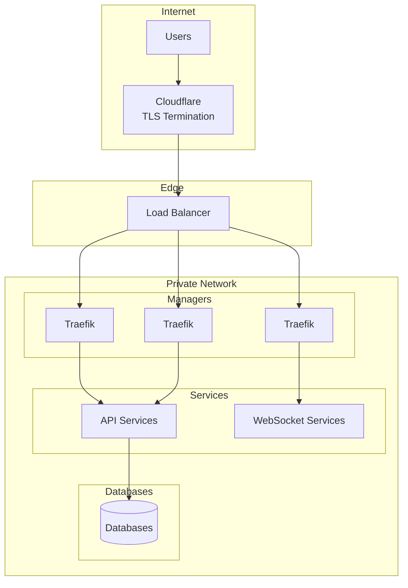
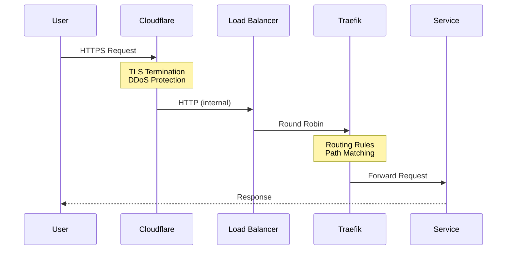
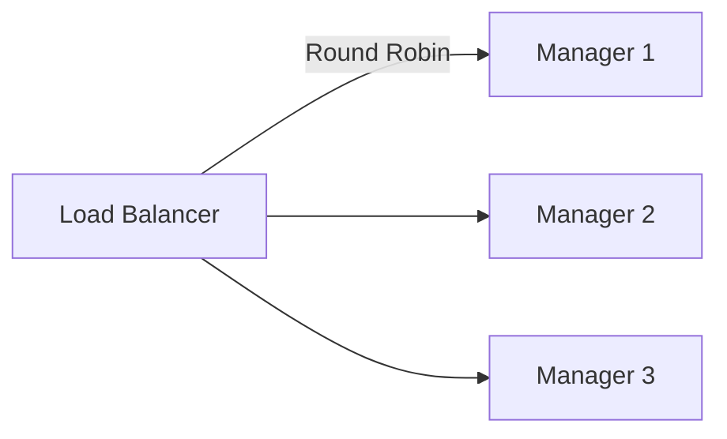
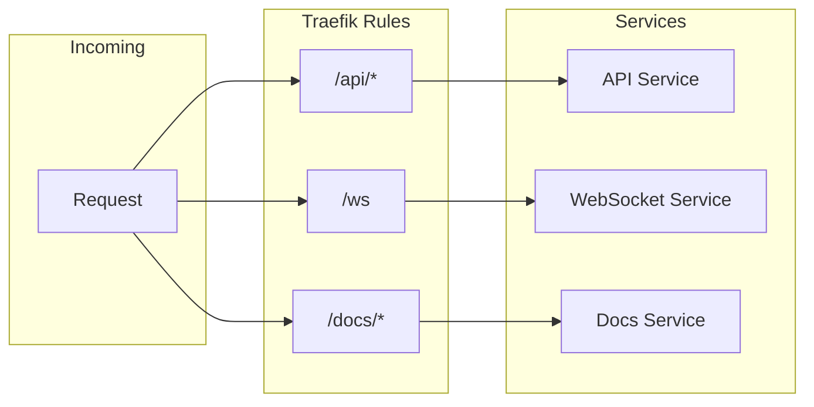
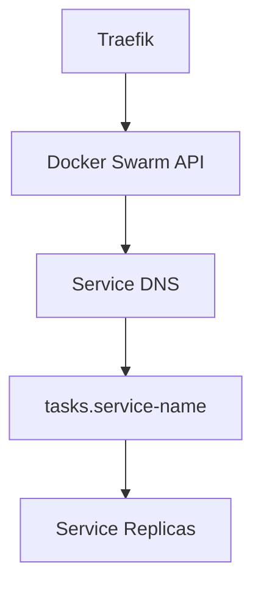
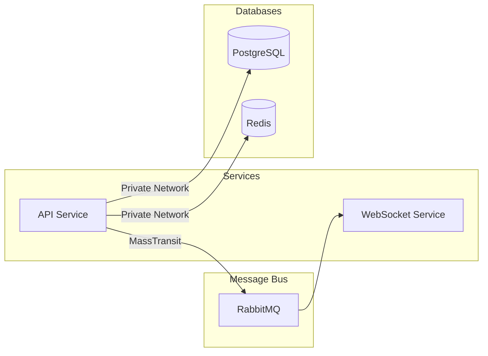
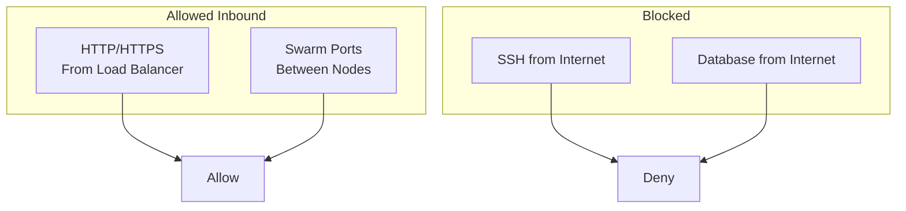
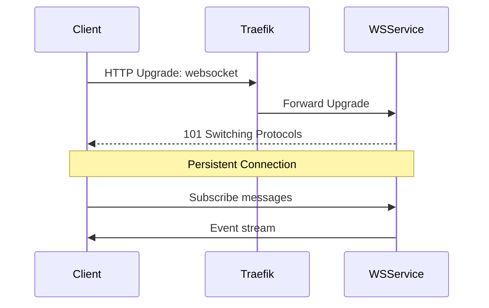

# Networking

This document covers the network architecture, ingress path, and routing patterns for Universalis.

## Network Topology

### Network Isolation

| Zone     | Purpose      | Access                  |
| -------- | ------------ | ----------------------- |
| Public   | User traffic | Internet via Cloudflare |
| Private  | Service mesh | Internal only           |
| Database | Data stores  | Services only           |

## Ingress Path

### TLS Termination

TLS is terminated at Cloudflare:

- Simplifies certificate management
- Enables DDoS protection
- Internal traffic uses HTTP

## Load Balancing

### External Load Balancer

- Round-robin distribution to manager nodes
- Health checks remove unhealthy managers
- Single public IP for all traffic

### Traefik Routing

Traefik runs on all manager nodes and handles:

- Path-based routing to services
- Host-based routing for subdomains
- WebSocket upgrades
- Metrics endpoint

## Routing Patterns

### Path-Based Routing

### Host-Based Routing

| Host                 | Service       |
| -------------------- | ------------- |
| universalis.app      | Main API      |
| docs.universalis.app | Documentation |

### Service Discovery

Docker Swarm provides:

- Automatic service registration
- DNS-based discovery (`tasks.<service>`)
- Health-aware routing

## Internal Communication

### Service to Service

- All internal traffic uses private network
- No public exposure of databases
- Message bus for async communication

### Database Connectivity

| Database   | Access Pattern                        |
| ---------- | ------------------------------------- |
| PostgreSQL | Direct connection, connection pooling |
| ScyllaDB   | Cluster-aware driver, multiple nodes  |
| Redis      | Multiplexed connections               |
| RabbitMQ   | AMQP over internal network            |

## Firewall Rules

Key rules:

- HTTP/HTTPS from load balancer only
- Swarm communication between nodes
- SSH restricted to management IPs
- Databases not publicly accessible

## WebSocket Handling

Traefik handles WebSocket upgrades transparently:

- Detects upgrade headers
- Maintains persistent connections
- Forwards bidirectional traffic
