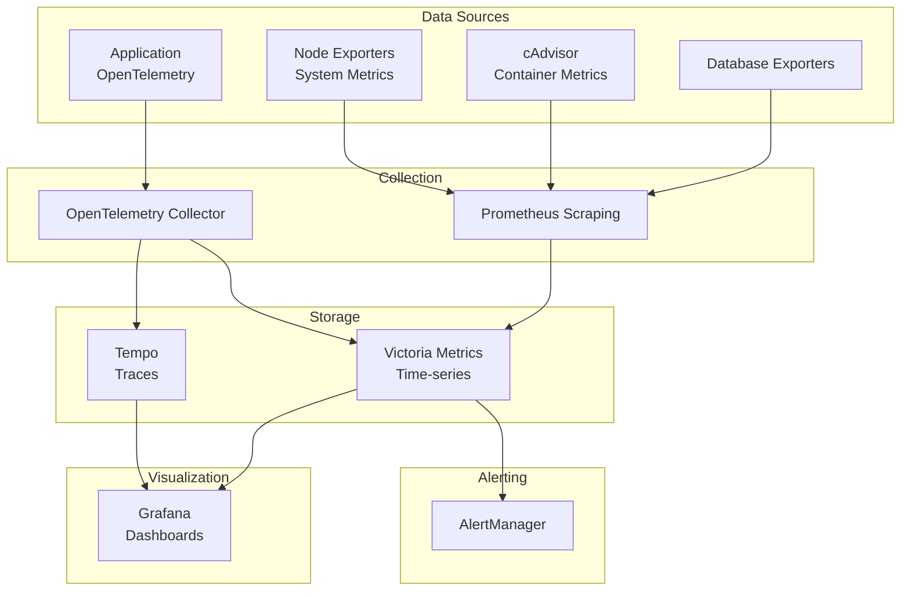
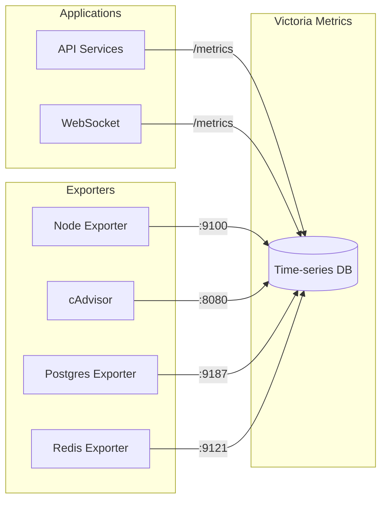
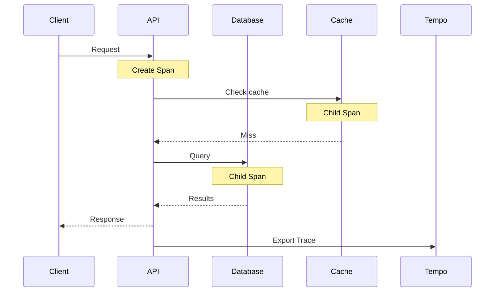
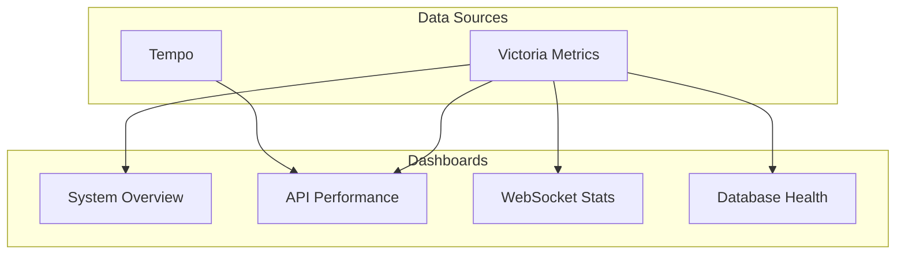
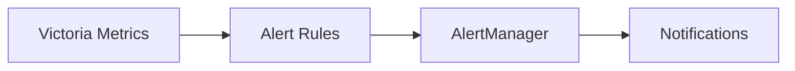

# Observability

## Observability Stack

## Metrics

### Collection Pipeline

### Key Metric Categories

#### WebSocket Metrics

| Metric                              | Type      | Description                     |
| ----------------------------------- | --------- | ------------------------------- |
| `universalis_ws_connections`        | Gauge     | Active WebSocket connections    |
| `universalis_ws_sent`               | Counter   | Total messages sent             |
| `universalis_ws_exceptions`         | Counter   | Connection errors               |
| `universalis_ws_queue_milliseconds` | Histogram | Broadcast latency               |
| `universalis_ws_discarded_messages` | Counter   | Messages dropped (backpressure) |

#### Database Metrics

| Metric                                 | Type      | Description             |
| -------------------------------------- | --------- | ----------------------- |
| `universalis_sale_rows_read`           | Histogram | Rows returned per query |
| `universalis_listing_local_cache_hit`  | Counter   | Listing cache hits      |
| `universalis_listing_local_cache_miss` | Counter   | Listing cache misses    |
| Query latency                          | Histogram | Via OpenTelemetry       |

#### Upload Metrics

| Metric                            | Type      | Description        |
| --------------------------------- | --------- | ------------------ |
| `universalis_upload_count`        | Counter   | Total uploads      |
| `universalis_upload_count_source` | Counter   | Uploads per source |
| Upload latency                    | Histogram | Via OpenTelemetry  |

## Distributed Tracing

### Trace Propagation

- **Protocol**: OpenTelemetry (OTLP)
- **Collector**: Receives traces via gRPC
- **Storage**: Tempo with local backend
- **Retention**: Configurable block retention

### Activity Sources

Application code creates spans for:

- HTTP request handling
- Database queries
- Cache operations
- Message bus publish/consume
- WebSocket operations

## Visualization

### Grafana Dashboards

### Dashboard Types

| Dashboard       | Purpose                             |
| --------------- | ----------------------------------- |
| System Overview | Cluster health, node status         |
| API Performance | Request rates, latencies, errors    |
| WebSocket       | Connections, message throughput     |
| Database        | Query performance, connection pools |
| ScyllaDB        | Cluster-specific metrics            |

## Alerting

### Alert Categories

| Category     | Examples                                 |
| ------------ | ---------------------------------------- |
| Availability | Service down, high error rate            |
| Performance  | High latency, slow queries               |
| Resources    | CPU, memory, disk thresholds             |
| Business     | Upload rate drops, WebSocket disconnects |

### Alert Flow

1. Victoria Metrics evaluates rules
2. Firing alerts sent to AlertManager
3. AlertManager deduplicates and groups
4. Notifications sent to configured channels

## Infrastructure Metrics

### Node Exporters

Every node runs Node Exporter for:

- CPU utilization
- Memory usage
- Disk I/O
- Network traffic

### cAdvisor

Container-level metrics:

- Container CPU/memory
- Network per container
- Filesystem usage

### Database Exporters

| Exporter   | Metrics                        |
| ---------- | ------------------------------ |
| PostgreSQL | Connections, queries, locks    |
| Redis      | Memory, commands, keyspace     |
| ScyllaDB   | Latency, compactions, sstables |
| RabbitMQ   | Queue depth, message rates     |

## Metric Storage

Victoria Metrics stores all time-series data:

- Prometheus-compatible query language
- Efficient storage compression
- Long-term retention
- High availability setup
