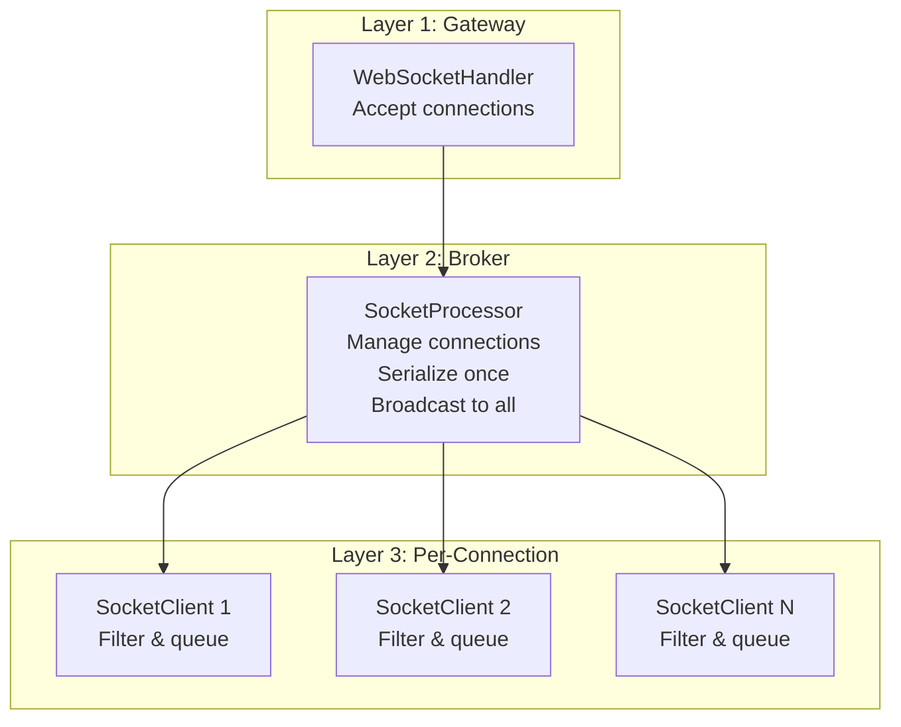
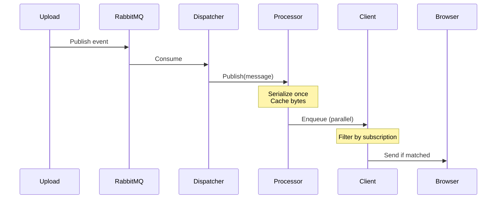
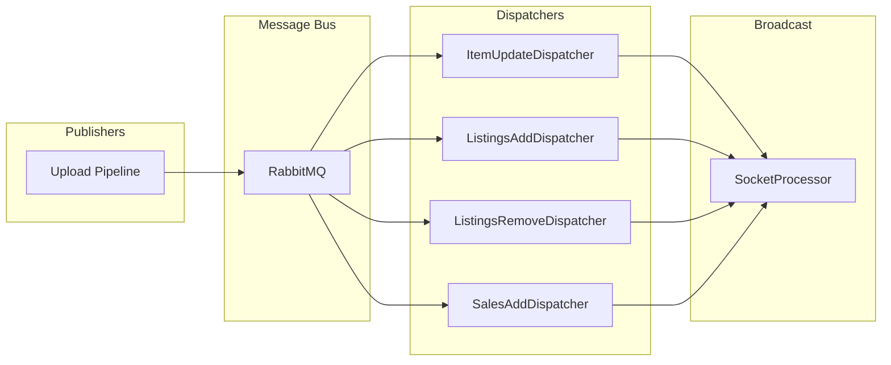
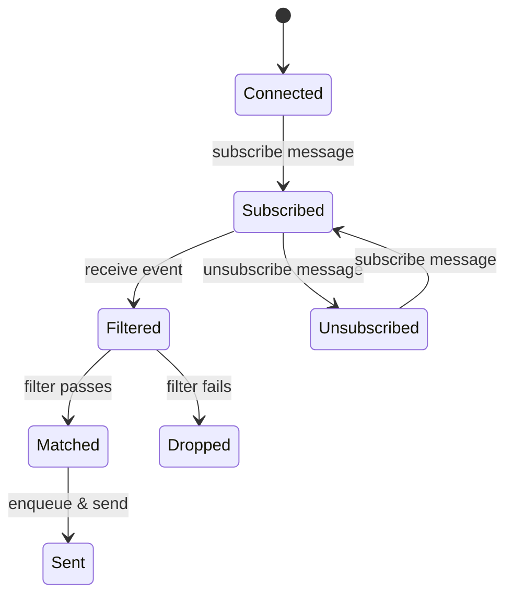

# Real-time Streaming

Universalis provides real-time market updates through WebSocket connections. The system uses a three-layer architecture to efficiently broadcast events to thousands of concurrent clients.

## Three-Layer Architecture



### Layer 1: WebSocketHandler

- Accepts WebSocket upgrade requests
- Creates TaskCompletionSource for connection lifecycle
- Delegates to SocketProcessor for management

### Layer 2: SocketProcessor

- **Connection Registry**: ConcurrentDictionary of all active clients
- **Single Serialization**: Each message serialized once, cached bytes reused
- **Parallel Broadcast**: Sends to all clients in parallel
- **Metrics**: Tracks connection count, messages sent, queue latency

### Layer 3: SocketClient

- **Per-Connection State**: Subscription filters, message queue
- **Dual Async Loops**: Outbound (send) and Inbound (receive commands)
- **Priority Queue**: Bounded FIFO for pending messages
- **Backpressure**: Drops oldest messages when queue full

## Event Flow



## MassTransit Integration

Events flow through RabbitMQ using MassTransit:



## Event Subscription

Clients subscribe to events using a flexible filter syntax:



### Subscription Format

```
channel{property=value,property=value}
```

Examples:

- `listings/add{world=74,item=5}` - Listings for specific world/item
- `sales/add` - All new sales
- `item/update` - All item updates

### Filter Matching

- Hierarchical channels: `listings` matches `listings/add`
- Property filters applied via reflection
- Automatic subscription upgrade/downgrade

## Message Types

| Channel           | Event Type     | Payload                      |
| ----------------- | -------------- | ---------------------------- |
| `item/update`     | ItemUpdate     | World, item, listings, sales |
| `listings/add`    | ListingsAdd    | New listings with details    |
| `listings/remove` | ListingsRemove | Removed listing IDs          |
| `sales/add`       | SalesAdd       | New sales with details       |

## Performance Optimizations

### Cached Serialization

Messages are serialized to BSON once and the bytes are cached:

- Avoids re-serializing for each client
- Memory pooling via RecyclableMemoryStreamManager

### Parallel Broadcast

- Uses `Parallel.ForEach` with `ProcessorCount * 2` parallelism
- Each client receives reference to same cached bytes
- 

### Priority Queue Backpressure

- Queue limited to 30 messages per client
- Oldest messages dropped when full (not newest)
- Prevents slow clients from consuming memory
- Metrics track discarded message count

## Metrics

| Metric                              | Description                          |
| ----------------------------------- | ------------------------------------ |
| `universalis_ws_connections`        | Active connection count              |
| `universalis_ws_sent`               | Total messages sent                  |
| `universalis_ws_exceptions`         | Connection errors                    |
| `universalis_ws_queue_milliseconds` | Broadcast latency                    |
| `universalis_ws_discarded_messages` | Messages dropped due to backpressure |
