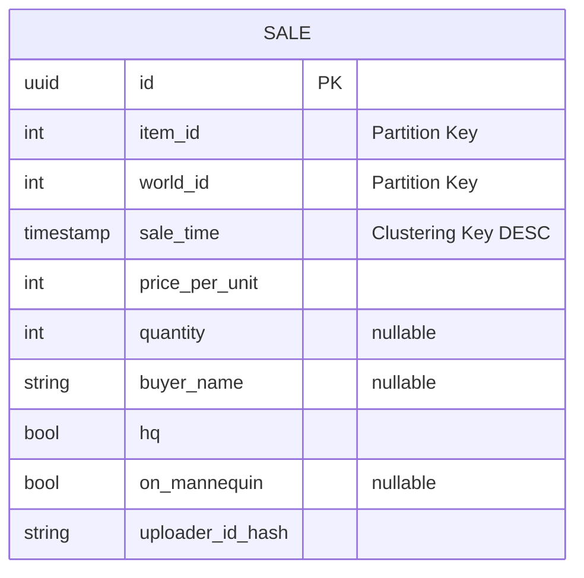
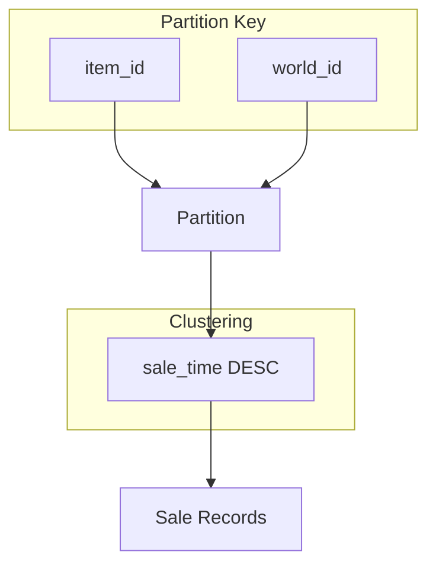
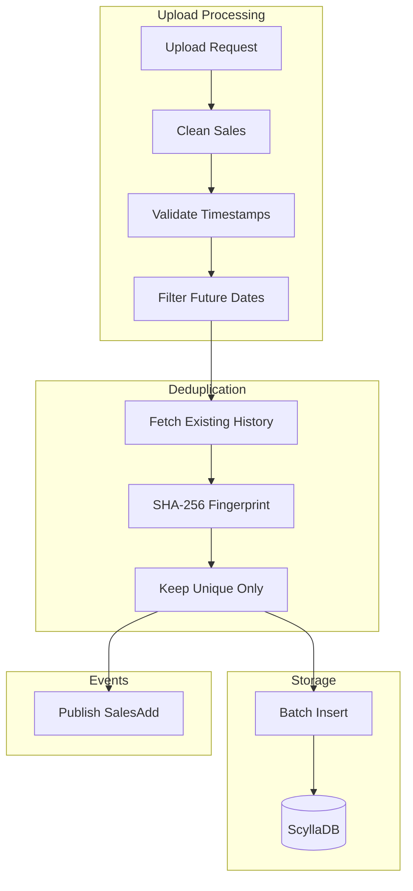
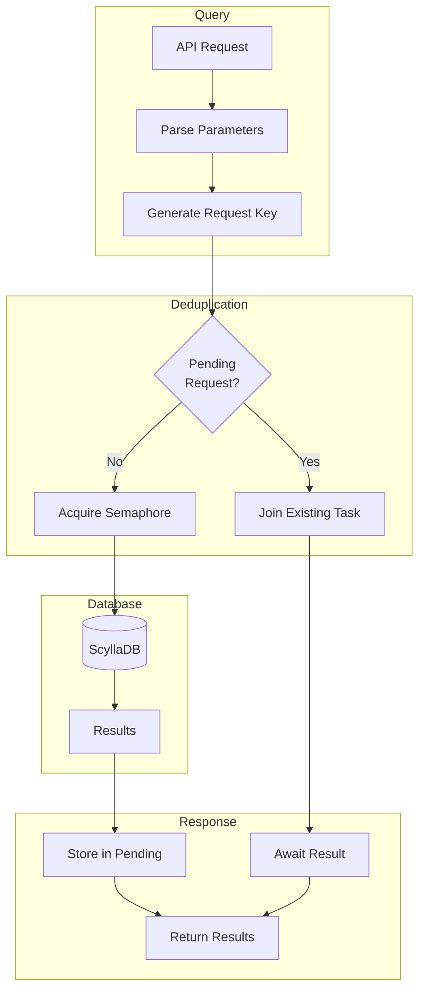
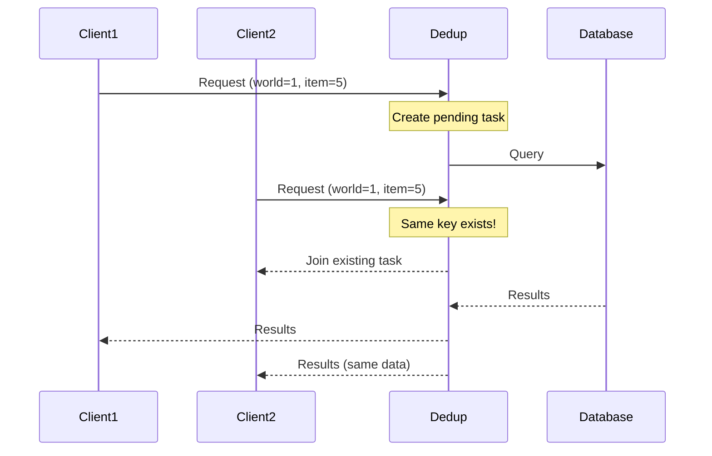

# Sales Data Flow

Historical sales represent completed transactions. This document covers storage, querying, and the request deduplication pattern.

## Why ScyllaDB?

Sales are stored in ScyllaDB (Cassandra-compatible) because:

- **Time-Series Data**: Sales are append-only, ordered by time
- **High Write Throughput**: Can handle massive upload volume
- **Horizontal Scaling**: Add nodes to increase capacity
- **Partition Strategy**: Efficient queries by item/world

## Sale Entity



### Partitioning Strategy



- **Partition Key**: `(item_id, world_id)` - all sales for an item on a world are co-located
- **Clustering Key**: `sale_time DESC` - newest sales first within partition
- Enables efficient "most recent N sales" queries

### Nullable Fields

Some fields were added after initial launch:

- `quantity` - Added later, older records may be null
- `buyer_name` - Added May 2022
- `on_mannequin` - Added June 2022

## Write Path



### Sale Fingerprinting

Sales are deduplicated using a fingerprint:

```
SHA-256(item_id + world_id + price + quantity + sale_time + buyer + hq)
```

This prevents duplicate sales from multiple uploaders seeing the same transaction.

## Read Path



### Request Deduplication Pattern

A key optimization for handling load spikes:



The deduplication key includes:

- `worldId`
- `itemId`
- `count` (number of entries)
- `from` (time range start, if specified)
- `to` (time range end, if specified)

### Throttling

A semaphore limits concurrent ScyllaDB requests to prevent overload:

- Prevents thundering herd scenarios
- Configurable concurrency limit
- Works with deduplication for maximum efficiency

## Query Patterns

### Recent Sales

```cql
SELECT * FROM sale
WHERE item_id = ? AND world_id = ?
ORDER BY sale_time DESC
LIMIT ?
```

### Time-Filtered Sales

```cql
SELECT * FROM sale
WHERE item_id = ? AND world_id = ?
  AND sale_time >= ? AND sale_time <= ?
ORDER BY sale_time DESC
```

## Pagination

For large result sets:

- Configurable page size (default: 100)
- ScyllaDB handles pagination automatically
- Prevents memory exhaustion on massive histories

## Connection Configuration

| Setting                     | Value              | Purpose                       |
| --------------------------- | ------------------ | ----------------------------- |
| Max requests per connection | 3000               | Prevent connection saturation |
| Query timeout               | 5000ms             | Fail fast on slow queries     |
| Speculative execution       | 3 attempts @ 400ms | Handle tail latencies         |
| Default idempotence         | true               | Safe retries                  |

## Metrics

| Metric                       | Description                |
| ---------------------------- | -------------------------- |
| `universalis_sale_rows_read` | Histogram of rows returned |
| Query latency                | Via OpenTelemetry tracing  |
