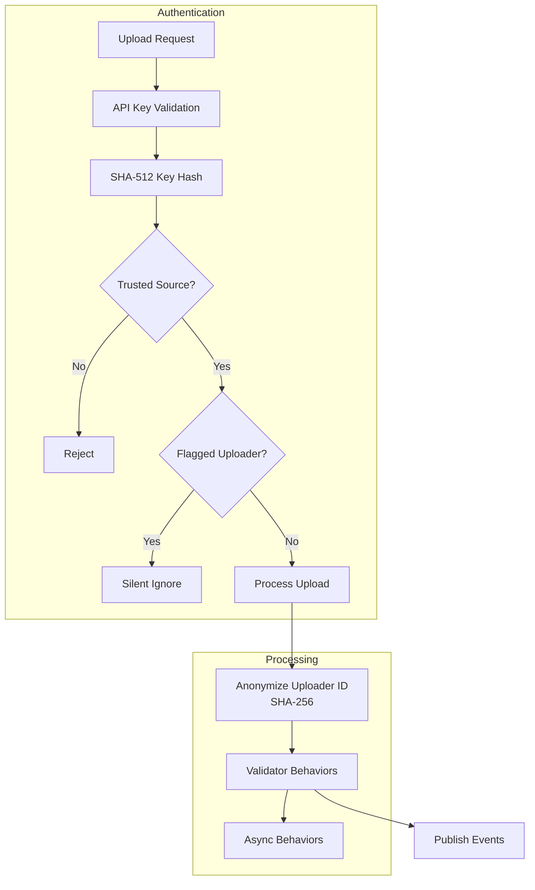
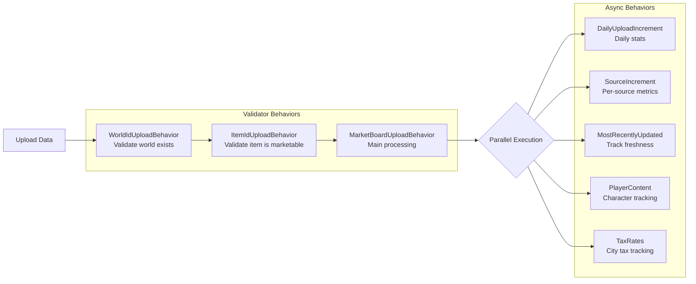
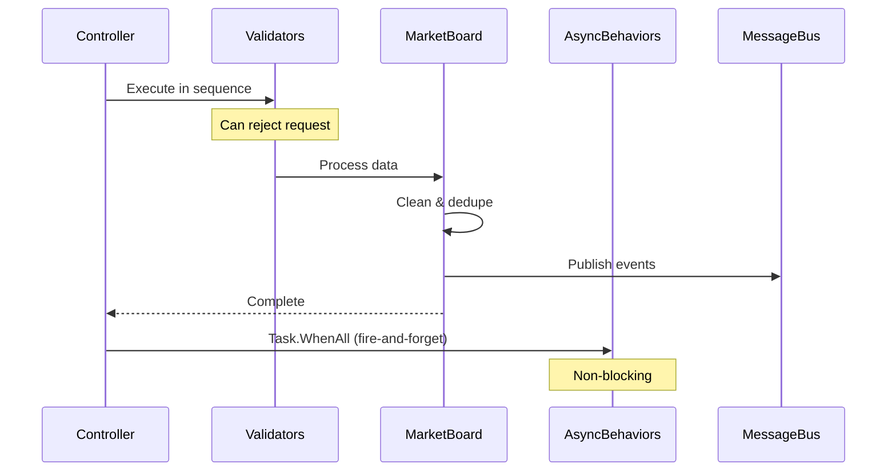
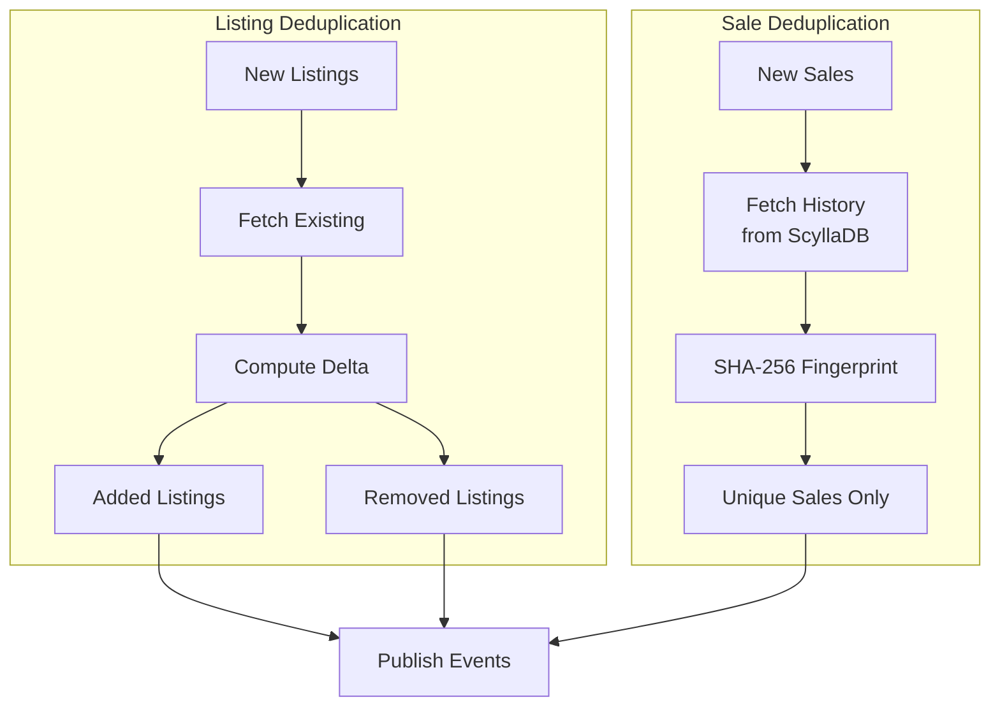

# Upload Pipeline

The upload pipeline processes market data from game clients, validates it, and distributes it to storage and real-time subscribers.

## Upload Flow Overview

## Behavior Pattern Architecture

Uploads are processed through a pipeline of behaviors implementing `IUploadBehavior`. Behaviors are classified as either **validators** (blocking) or **async** (fire-and-forget).

## Behavior Execution

## Data Cleaning

The MarketBoardUploadBehavior performs extensive cleaning:

### Listing Cleaning

- Generate listing IDs if missing (SHA-256 hash of key fields)
- Remove HTML tags from names
- Validate materia slots and IDs
- Normalize unusual boolean/integer formats

### Sale Cleaning

- Validate timestamps (reject future dates)
- Validate prices and quantities
- Remove duplicates against existing history

## Deduplication

## Event Publishing

After processing, events are published to the message bus:

| Event            | Trigger                    | Consumers             |
| ---------------- | -------------------------- | --------------------- |
| `ListingsAdd`    | New listings detected      | WebSocket subscribers |
| `ListingsRemove` | Listings no longer present | WebSocket subscribers |
| `SalesAdd`       | New sales recorded         | WebSocket subscribers |
| `ItemUpdate`     | Any change to item data    | WebSocket subscribers |

# 
